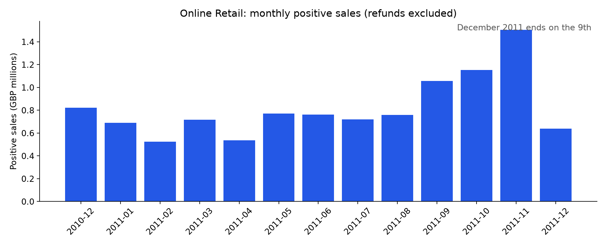

# Retail Sales Explorer

Which markets, months, and products account for positive sales?

**Python · pandas · SQLite · data quality · dashboard**

A reproducible student portfolio project with a complete Python pipeline, an executed explanatory notebook, saved results, tests, and a standalone interactive demo. Built with AI assistance; review the methodology and make your own extensions before describing it as independent work.



## Try the demo

Open `demo/index.html` in a browser. It runs offline and needs no API key, server, or Python packages. If your browser blocks local files, run:

```bash
python run_demo.py
```

Then visit http://127.0.0.1:8000. Change the port with `--port 8001`. The demo uses real exported analysis/model results, not invented values.

## Results

- 541,909 original rows; 524,878 positive-sale rows after cleaning.
- £10,642,110.80 in positive sales across 19,960 invoices.
- 4,338 identifiable customers; missing IDs remain in sales totals.
- UK sales account for 84.6% of the total.
- December 2011 is partial, ending on 9 December.

These are measured results from the included pipeline, not targets or promised production performance.

## Method

The pipeline loads the original Excel workbook, removes exact duplicates, excludes cancellations and invalid or nonpositive transactions, and retains missing customer IDs for sales analysis. SQLite computes monthly aggregates; pandas builds country/month slices. The demo filters markets and periods, recomputing KPIs from precomputed exact slices.

## Reproduce

Python 3.12 is the tested version. From this repository folder:

```bash
python -m venv .venv
```

Activate with `.venv\Scripts\Activate.ps1` in Windows PowerShell, or `source .venv/bin/activate` on macOS/Linux. Then:

```bash
python -m pip install -r requirements.txt
python -m src.pipeline
python -m unittest discover -s tests -v
```

The first pipeline run downloads the public dataset from UCI. Subsequent runs use `data/raw/`. Internet access is needed for initial dependency and dataset downloads only. Exact dependency versions are pinned. Reports and `demo/data.js` are regenerated together.

With Node.js 22 or newer, also verify the browser export:

```bash
node tests/test_browser_model.cjs
```

To explore the notebook interactively:

```bash
python -m pip install -r requirements-notebooks.txt
python -m notebook notebooks/analysis.ipynb
```

## Repository layout

- `src/`: documented data preparation and analysis/model code.
- `notebooks/analysis.ipynb`: executed walkthrough with outputs and discussion.
- `reports/`: actual tables, a figure, and a machine-readable analysis export.
- `demo/`: static HTML/CSS/JavaScript app with portable data/model.
- `tests/`: data-quality, calculation, model, and export checks.
- `DATA.md`: citation, CC BY 4.0 license, source hash, transformations.
- `STUDY_GUIDE.md`: concepts, questions, and suggested personal extensions.
- `.github/workflows/checks.yml`: Python and JavaScript checks after upload.

## Limitations

Positive sales exclude refunds and costs, so they are neither net revenue nor profit. Service/postage codes are included. Duplicate removal is a documented assumption. This single historical retailer is not representative of all ecommerce.

## Publishing later

This folder can be uploaded as its own GitHub repository. The demo consists only of static files and can later be hosted by publishing the contents of `demo/`. No credentials belong in this repository. Raw data and virtual environments are gitignored. No cloud account or paid service is required to run it locally.

## Data and license

See [DATA.md](DATA.md) for the UCI dataset attribution and CC BY 4.0 terms. Authored code is [MIT licensed](LICENSE). The dataset license is separate.
